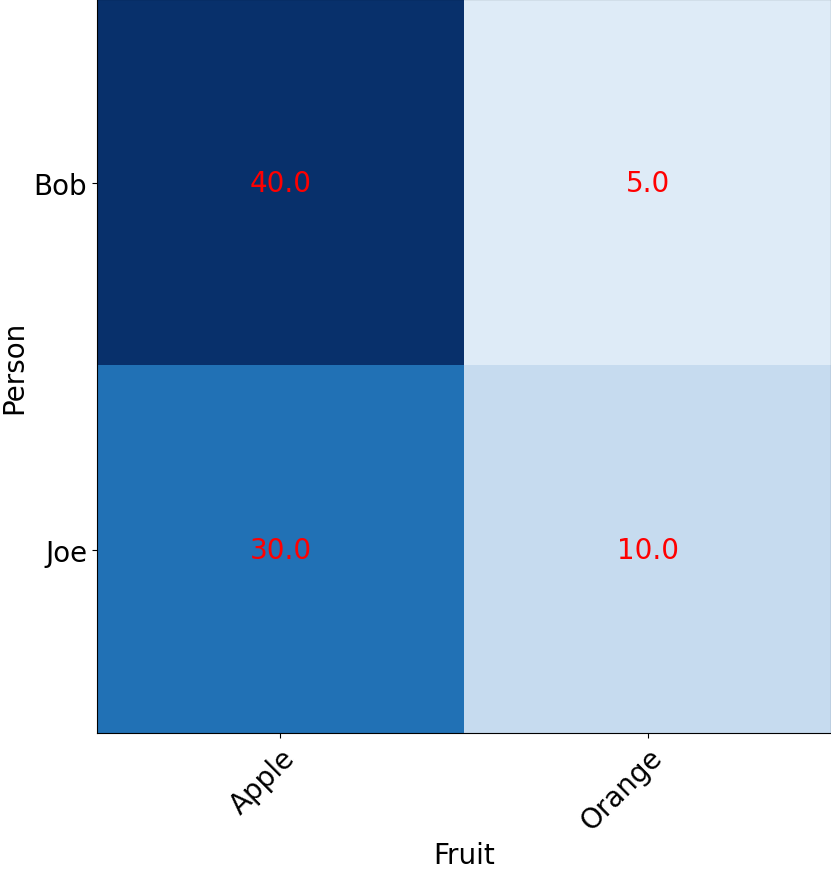

### pdbheatmap - find all unique values of a key column

`pdbheatmap` produces a graphical "heat map" of values contained
within a FSDB file given two key columns.  It is most useful to get a
visual representation of scored data, for example.

#### Example input (*myheat.fsdb*):

Consider the following example input file, where Joe and Bob were
asked to score their favorite fruits on a scale from 1 to 50.

```
#fsdb -F t Person Fruit value
Joe	Orange	10
Joe	Apple	30
Bob	Orange	5
Bob	Apple	40
```

#### Example command usage

We can then run `pdbheatmap` to generate a graphical map that shows
clearly that when you compare Apples and Oranges, Apples will win.

```
$ pdbheatmap -c Person Fruit -v value myheat.fsdb myheat.png -R -fs 20  -L
```

#### Example output


